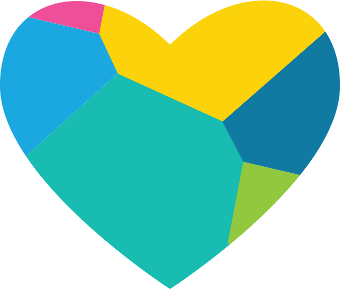

### Hi, I'm Anish! 👋

I have been a Google Summer of Code(GSoC) developer @Elastic  in 2020.

Besides coding, I like sleeping 😴

- :man_technologist: Code: HTML, CSS, JavaScript, TypeScript, Node.js, C++, GraphQL, GoLang, Ruby and Python.
- Backend: ExpressJs, MUX, Fiber, Rails.
- Frontend: ReactJs, ElectronJs, Gatsby, NextJs, webpack.
- Android: react-native, expo
- :cloud: Technologies: Vercel, AWS, Docker, Firebase.
- DB: MongoDb, PostgreSQL, DynamoDB, LevelDB.
- 🌺 Styling: Elastic UI, Material UI, styled-components.
- 📊 Others: Blockchain, framer-motion, 3JS, D3

View Resume : <a href="https://cutt.ly/resume_anish">Link</a>

<!---
I am an open-source enthusiast, passionate about algorithms, competitive programming and software development. Besides, I have also begun to explore the world of Frontend development and Backend development (ReactJs, GraphQl, and NodeJs mainly). I enjoy problem-solving and creating new stuff using 3Js.
--->

<!---->

Contact me:

<!---

--->
